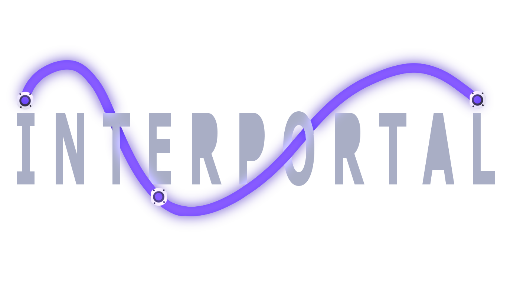
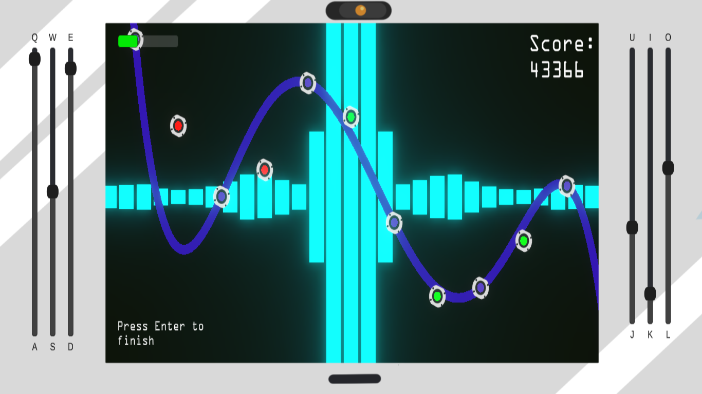

# Interportal

Puede descargar el módulo de ~~juego~~ trabajo [AQUÍ](https://github.com/InterfaSus/Interpolation-DJ/releases/latest/)  

Puede descargar el módulo de ~~juego~~ trabajo [AQUÍ](https://github.com/InterfaSus/Interpolation-DJ/releases/latest/)

## INSTRUCCIONES PARA EL USO Y MANEJO DEL CALIBRADOR DE PORTALES™

No se deje intimidar por las pésimas condiciones de trabajo, el salario “bajo” o las extensas condiciones que establece el contrato, USTED hA LLEGADO A SU PUESTO DE TRABAJO FAVORITO!!!  
De lo único que usted deberá encargarse en esta empresa es calibrar los sensores láser de los cosos (núcleos de personalidad) que flotan en la consola haciendo que el láser los intercepte. Para esto usted puede mover otros núcleos más… disciplinados (los moraditos), arriba y abajo, para alterar la forma del láser (así es, aquí en A.S. tenemos láseres curvos), y así aproximar los núcleos rojos de la mejor manera posible. Una vez que crea tener una buena aproximación pulse ESPACIO, y si esta aproximación es buena podrá pasar a la siguiente ronda. Pero no se sienta agobiado por todos los botones!, nosotros nos preocupamos por su estrés asi que los controles irán desbloqueándose poco a poco, ya vera que en seguida se adapta a su nuevo puesto de trabajo!!  
**Tenga en cuenta que no es obligatorio que el láser pase directamente por todos los puntos, basta con que se acerque más o menos bien (los puntos ni siquiera tienen que estar verdes)**. Aún así recuerde que mientras mejor sea su aproximación, mayor será su pago a final de mes.  

## CONTROLES

En la imagen puede ver su área de trabajo. Cada punto morado puede subirse o bajarse con las teclas que ve en los deslizadores a los lados. Sin embargo se habilitará una cantidad de controles según la cantidad de puntos móviles. Dichos controles se habilitan de afuera hacia adentro y de izquierda a derecha. Por ejemplo, cuando hay 2 puntos, estos se controlan con Q-A y O-L respectivamente. Cuando hay 3 puntos, los dos de afuera se controlan con Q-A y O-L, y el del centro con W-S. Al haber 4 puntos, los dos exteriores con Q-A y O-L, y los dos interiores con W-S y I-K; y así hasta 6 puntos.

## Nota

Debido al alto números de quejas del corte de:

- “Odio mi trabajo” Alberto, 1999 – 2022
- “Nunca he recibido vacaciones” Steve, 1989 – 2022
- “Es cierto que si te quejas te mandan a matar?” Roger, 2001 – 2022
- “No ha habido muchos accidentes últimamente?” Laura, 1988 – 2022

Hemos decidido modernizarnos y ofrecer un espacio de trabajo divertido y ameno. **¡¡¡AHORA PUEDE TRABAJAR SUS 14 HORAS ASIGNADAS AL RITMO DE SU CANCION FAVORITA!!!**  
**¡¡¡CUENTAN QUE SI ESTAS EN EL TOP 5 DE MEJORES TRABAJADORES OBTENDRAS UN CAKE 🎂 ;D!!!**  

## Términos y condiciones del contrato

Copyright 2022 Interfasus  
  

Permission is hereby granted, free of charge, to any person obtaining a copy of this software and associated documentation files (the "Software"), to deal in the Software without restriction, including without limitation the rights to use, copy, modify, merge, publish, distribute, sublicense, and/or sell copies of the Software, and to permit persons to whom the Software is furnished to do so, subject to the following conditions:
  

The above copyright notice and this permission notice shall be included in all copies or substantial portions of the Software.

THE SOFTWARE IS PROVIDED "AS IS", WITHOUT WARRANTY OF ANY KIND, EXPRESS OR IMPLIED, INCLUDING BUT NOT LIMITED TO THE WARRANTIES OF MERCHANTABILITY, FITNESS FOR A PARTICULAR PURPOSE AND NONINFRINGEMENT. IN NO EVENT SHALL THE AUTHORS OR COPYRIGHT HOLDERS BE LIABLE FOR ANY CLAIM, DAMAGES OR OTHER LIABILITY, WHETHER IN AN ACTION OF CONTRACT, TORT OR OTHERWISE, ARISING FROM, OUT OF OR IN CONNECTION WITH THE SOFTWARE OR THE USE OR OTHER DEALINGS IN THE SOFTWARE.
  

THE CAKE IS A LIE THE CAKE IS A LIE THE CAKE IS A LIE THE CAKE IS A LIE THE CAKE IS A LIE THE CAKE IS A LIE THE CAKE IS A LIE THE CAKE IS A LIE THE CAKE IS A LIE THE CAKE IS A LIE THE CAKE IS A LIE
 
